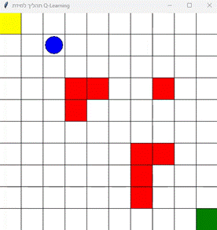
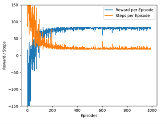

# 🤖 Robot Path Planning with Reinforcement Learning  

This project implements **robot navigation in a 2D grid world** using two key Reinforcement Learning (RL) algorithms:  
- **Q-Learning** (tabular)  
- **Deep Q-Network (DQN)**  

The goal is to train an agent (robot) to navigate through a grid with obstacles and reach the target by maximizing cumulative rewards.  

---

## 🚀 Features
- **Q-Learning** implementation with ε-greedy exploration.  
- **Deep Q-Network (DQN)** with neural network approximation.  
- Reward shaping for efficient learning.  
- Logging of training progress and visualization of results.  
- Full documentation of methods and analysis in [Final Report](docs/final-report.docx).  

---

## 📂 Project Structure
robot-path-planning-rl/
├─ src/
│ ├─ q_learning.py # Tabular Q-Learning
│ └─ dqn.py # Deep Q-Network
├─ docs/
│ └─ final-report.docx # Full academic report
├─ assets/ # Screenshots / plots (optional)
├─ requirements.txt
└─ README.md

---

## ⚙️ Installation & Setup

1. Clone the repository:
bash
git clone https://github.com/segevis/robot-path-planning-rl.git
cd robot-path-planning-rl
Create a virtual environment (optional but recommended):
python -m venv .venv
# Windows: .venv\Scripts\activate
# Linux/Mac: source .venv/bin/activate

Install dependencies:
pip install -r requirements.txt

▶️ Running the Algorithms
Run Q-Learning:
python src/q_learning.py
Run DQN:
python src/dqn.py

---

## 📊 Results
- **Q-Learning**: works well on small grid environments, fast to implement and explain.  
- **DQN**: scales better to larger and more complex environments, thanks to the neural network function approximation.  
- The trade-off: Q-Learning is simple and interpretable, while DQN is more powerful but requires more compute.

## 📸 Example Results

---

## 💡 What I Learned
- Hands-on practice with Reinforcement Learning fundamentals.  
- How to implement and compare classical (tabular) vs. deep learning approaches.  
- Debugging, hyperparameter tuning, and analyzing convergence in RL.  
- Presenting results in a clear and reproducible way.  

---

## 👤 Author
Developed by **Segev** as part of an academic Artificial Intelligence project.

